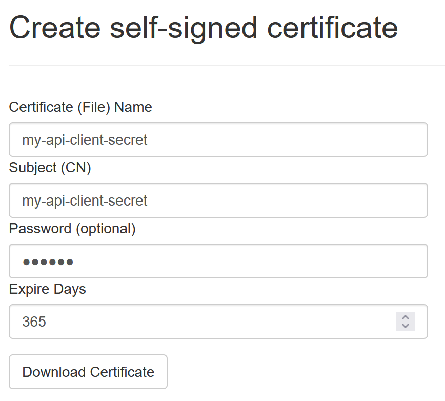
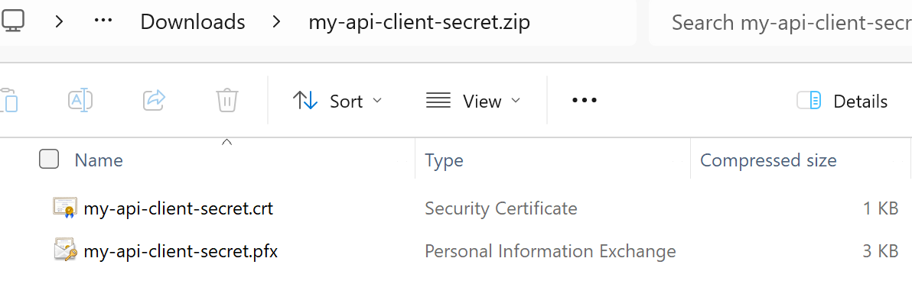

Selbst-Signierte Zertifikate erstellen
======================================

**IdentityServerNET** bietet ein *Admin-Werkzeug* zum erstellen von 
selbst-signierten Zertifikate. Das Ergebnis ist ein *ZIP-File* mit folgendem 
Inhalt:

* **{cert-name}.pfx:** Das Zertifikate als PFX Datei
* **{cert-name}.crt:** Der öffentliche Schlüssel des Zertifikate als CRT Datei

.. note::

    CRT Dateien können in einem Text Editor geöffnet werden und haben folgendes 
    Format:

    .. code::

        -----BEGIN CERTIFICATE-----
        MIICsDCCAZigAwIBAgIIHFgs7XAI8jgwDQYJKoZIhvcNAQELBQAwGDEWMBQGA1UEAxMNY2xpZW50
        LXNlY3JldDAeFw0yNDA4MjMwNTA0NThaFw0yNTA4MjMwNTA0NThaMBgxFjAUBgNVBAMTDWNsaWVu
        ...
        -----END CERTIFICATE-----

Ein Grund, warum ein selbst-signiertes Zertifikat erzeugt wird, ist, dass diese als 
als **Secret** für **Clients** verwendet werden.

Um ein Zertifikat zu erzeugen, wechselt man auf der *Admin-Seite* in den Bereich ``Create Certs``:

* **Certificate (File) Name:** ein Name für das Zertifikat. Dieser entspricht dem Filenamen
  des ZIP-Files und der einzelnen Files.

* **Subject (CN):** Das Subject für das Zertifikat (CN=...). Dieser Name steht im Zertifikat.

* **Password:** Ein optionales Passwort für das Zertifikat. Das PFX lässt sich später nur 
  mit diesem Passwort öffnen.

* **Expire Days:** Die Anzahl der Tage, nach dem dieses Zertifikat abläuft.

Klickt man auf ``Download Certificate`` wird eine ZIP Datei mit folgendem Inhalt 
herunter geladen:

