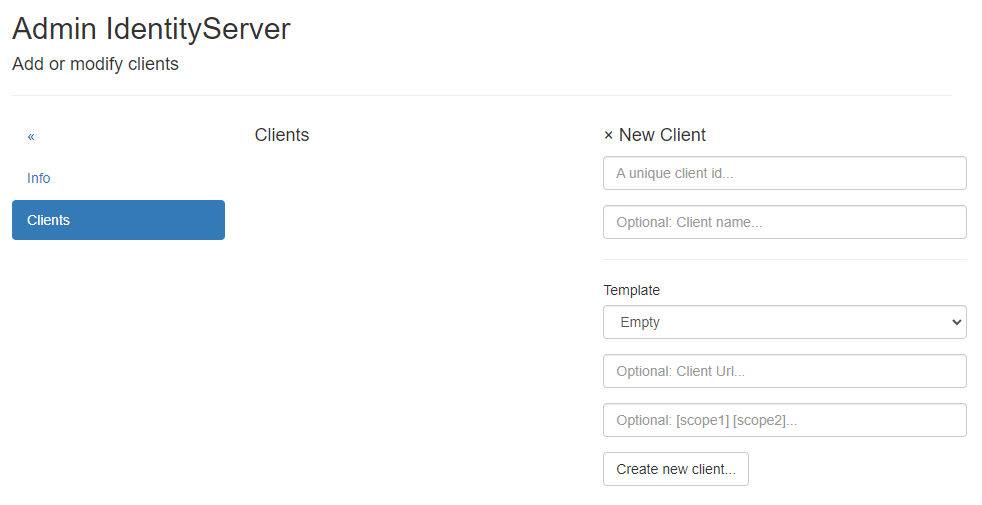

Clients verwalten
=================

Clients sind Anwendungen, die sich über den IdentityServer anmelden können. Dabei können folgende Anwendung Typen unterschieden werden:

* **Web Anwendung:** Eine Web Anwendung, bei der sich Anwender mit User/Passwort anmelden müssen. 
* **Api Clients:** Anwendungen, die auf eine (Web) API zugreifen müssen, die wiederum einen gültigen *Bearer Token* verlangt, der vom IdentityServer 
  ausgestellt wurde.
* **JavaScript Client:** Eine *Single Page Web Seite* oder *statische Web Seite*, bei der eine Anmeldung über User und Passwort notwendig ist. 

Zum Verwalten und Erstellen von Clients, muss man als Administrator angemeldet sein. Im *Admin Bereich* gibt es die Kacken ``Clients``, die zur
Ansicht ``Add or modify clients`` führt:

Von hier aus können neue Clients erstellt bzw. bestehende Clients verwaltet werden.

.. toctree::
   :maxdepth: 2
   :caption: Contents:

   webapp
   api

   

   