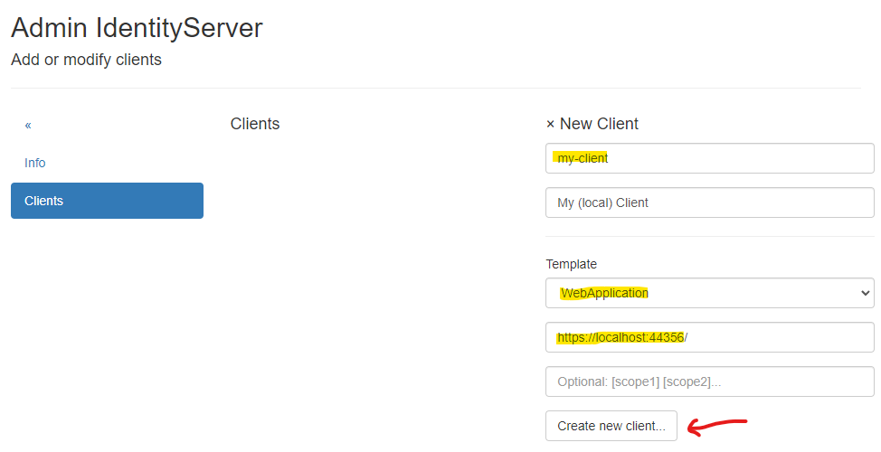
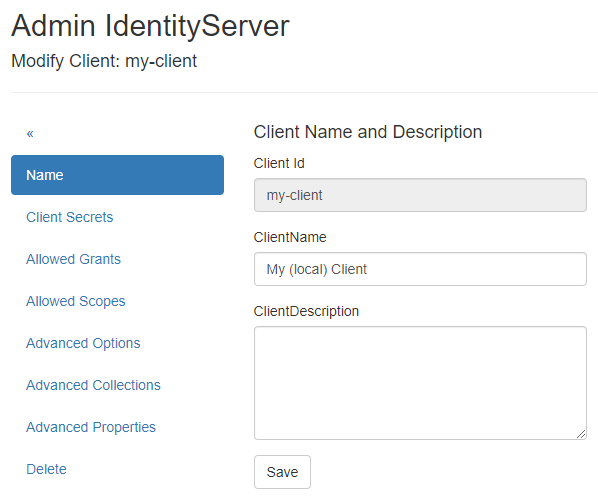
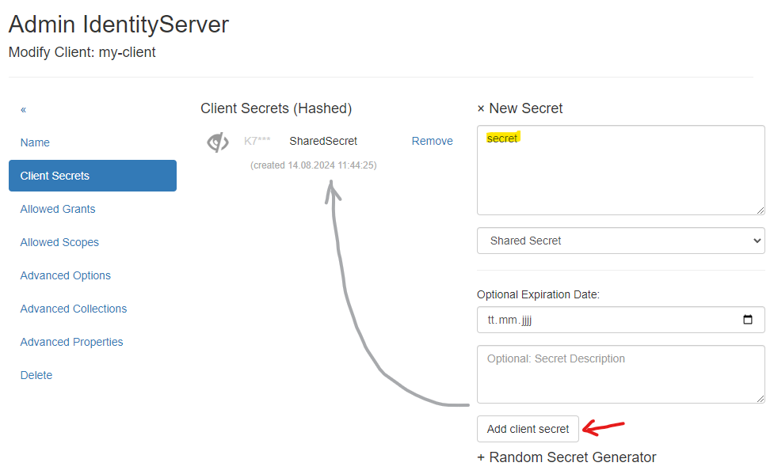
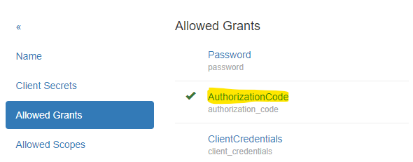
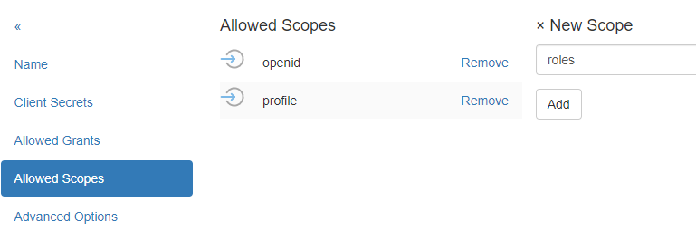
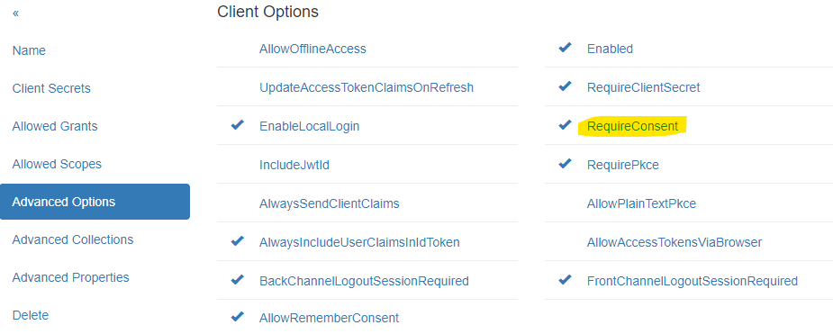
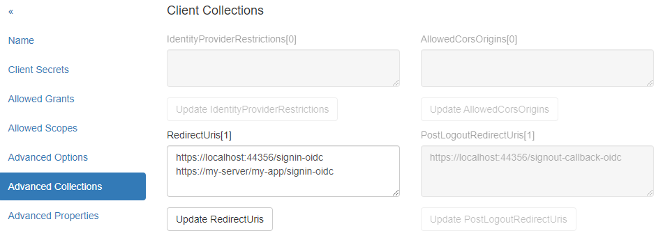

Web Anwendung
=============

Client erstellen/bearbeiten
---------------------------

Um einen neuen *Client* zu erstellen, muss eine eindeutige *Client Id* vergeben werden. 
Optional kann auch ein sprechender Name vergeben werden.

Damit nicht alles manuelle eingegeben werden muss, sollte als Template ``WebApplication`` eingetragen 
werden. Außerdem sollte für diesem Template 
die Url zur Web Anwendung eingetragen werden. Die Eingabe der **Scopes** ist optional. Diese können 
auch im nächsten Schritt noch bearbeitet werden.

Mit ``Create new client...`` wird der neue Client erzeugt:

Wurde der Client erfolgreich erzeugt, kommt man zur Seite ``Modify Client: ...``. Hier sind die 
unterschiedlichen Eigenschaften für den Client in Menüpunkten gegliedert:

``Name``:
+++++++++

Hier kann der sprechende Name für den Client verändert werden. Außerdem kann eine Beschreibung 
für den Client eingetragen werden.

``Client Secrets``:
+++++++++++++++++++

Ein Client sollte auch ein **Secret** besitzen. Ein Client Anwendung, muss diesen **Secret** bei der Anmeldung mitschicken. Ein **Secret** kann sowohl ein 
Text (**Shared Secret**) als auch ein Zertifikat sein (**X509 Certificate *.crt**) sein. Ein **Shared Secret** kann ebenfalls in den **Secrets Vault** gespeichert werden (siehe später).

Das **Shared Secret** kann ein beliebiger Text sein, eine Art Passwort. Möchte man ein sicheres **Secret** erzeugen, kann man den ``Random Secret Generator`` auf dieser Seite verwenden.

.. note:: 

    Einem **Secret** kann ebenfalls ein Ablaufdatum (``Optional Expiration Date``) und eine Beschreibung haben.

Das **Secret** sollte sicher sein. Für dieses Beispiel soll der einfach halber das **Secret** den Wert ``secret`` haben und niemals ablaufen:

.. note::

    Es können mehre **Secrets** angelegt werden. Ein Client muss dann genau ein *gültiges* **Secret** übergeben. Das kann praktisch sein, wenn ein **Secret** getauscht werden muss.
    Dabei kann dass neue **Secret** neben dem alten **Secret** bestehen, bis alle Clients auf das neue **Secret** umgestellt sind. Erst dann kann der alte **Secret** gelöscht werden.

``Allowed Grants``:
+++++++++++++++++++

Hier können die **Grants** eingestellt werden, die für die Anmeldung erlaubt sind. Jede Anmeldungsmethode funktioniert mit unterschiedlichen **Grants**. Da beim Erstellen des 
Clients ``WebApplication`` als Template gewählt wurde, sollte hier schon die richten **Grants** eingestellt sein:

``Allowed Scopes``:
+++++++++++++++++++

Die **Scopes** geben an, welche **Identity Resources** die Web Anwendung für einen angemeldeten User abfragen kann. Ich dürfen nur **Scopes** eingetragen werden, die für 
den **IdentityServer.Nova** als **Identity Resources** eintragen sind (siehe Abschnitt Erste Schritte).

Für Web Anwendungen wird hier standardmäßig ``openid`` und ``profile`` eingetragen:

``Advanced Settings``:
++++++++++++++++++++++

Hier können weitere Optionen angeführt werden, die für die Anmeldung herangezogen werden. Beispielsweise kann angegeben werden, oder ein **Secret** von Client zwingend übergeben werden muss
(``RequireClientSecret``).
Über die Option ``RequireConsent`` kann gesteuert werden, ob ein User nach der Anmeldung noch zustimmen muss, ob die Web Anwendung zugriff auf die bestellen **Scopes** (Claims) haben darf:

``Advanced Collections``:
+++++++++++++++++++++++++

Hier können Auflistungen angeführt werden, die für die Anmeldung notwendig sind. Wichtig ist bei Web Anwendung immer, die Url der Seite, auf die eine erfolgreiche Anmeldung zurück geleitet wird (``RedirectUri``).
Möchte man hier mehrere Urls angeben, muss jeder Url in einer neuen Zeile angegeben werden:

Kommt die Anmeldungsaufforderung später nicht einer der Seiten, die hier aufgelistet ist, lässt **IdentityServer.Nova** diese nicht zu.

``Advanced Properties``:
++++++++++++++++++++++++

Erweiterte Einstellungen für den Client, wie ``IdentityTokenLifetime``, ``AccessTokenLifetime`` usw. Diese Werte brauchen in der Regeln nicht geändert werden.

``Delete``:
+++++++++++

Hier kann ein Client auch wieder gelöscht werden.

Client Web Anwendung anpassen
-----------------------------

Ein Client muss **OpenId Connect** unterstützen. In ASP.NET Core Umfeld werden hier die entsprechenden Methoden angeboten.

**IdentityServer.Nova** bietet dafür einen einfachen Weg über Erweiterungsmethoden des ``IServiceCollection`` Objektes an. Dazu muss folgendes ``nuget`` Paket installiert werden:

.. code:: powershell

    dotnet add package IdentityServer.Nova.Extensions.DependencyInjection

Über diese Paket wird ``IServiceCollection`` um folgende Methode erweitert:

.. code:: csharp
    
    using IdentityServer.Nova.Extensions.DependencyInjection;

    var builder = WebApplication.CreateBuilder(args);

    // ...

    builder.Services.OpenIdConnectAuthentication(builder.Configuration);

Die Methode entnimmt die Parameter aus der App-Configuration (zB. ``appsettings.json``). In der Configuration muss es einen Abschnitt ``OpenIdConnectAuthentication`` geben, in dem die notwendigen
Parameter enthalten sind.

.. note::

    Der Abschnittsname kann auch geändert werden. Dann mus der ``OpenIdConnectAuthentication`` der entsprechende Abschnitt übergeben werden.

.. code:: json

    {
        // ...
        "OpenIdConnectAuthentication": {
            "Authority": "https://localhost:44300",
            "ClientId": "my-client",
            "ClientSecret": "secret",
            "Scopes": "openid,profile"
        }
    }

