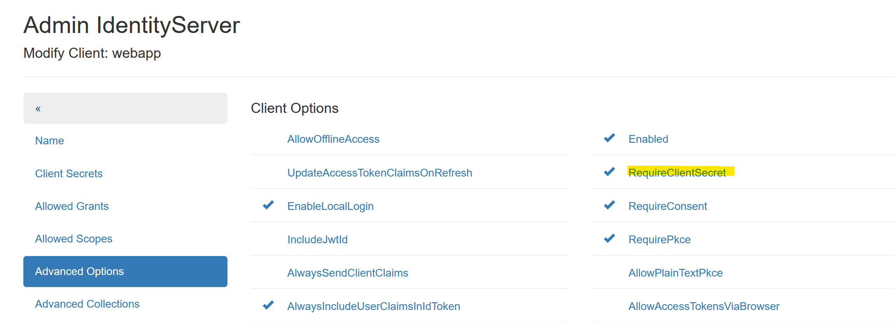
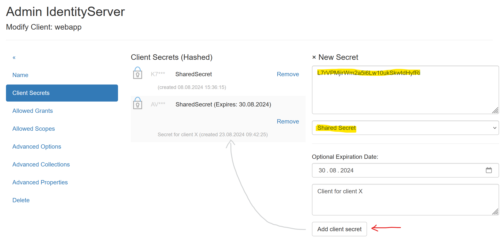
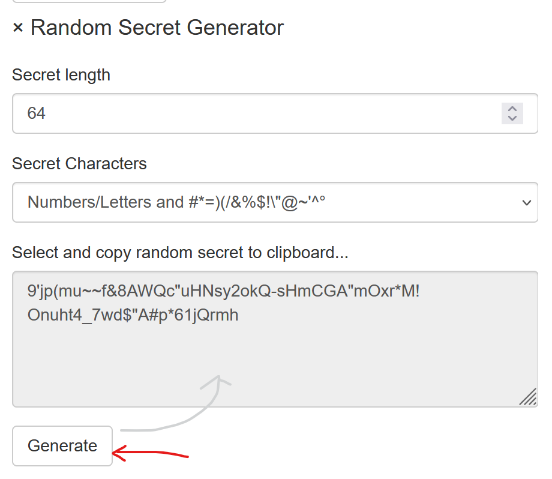
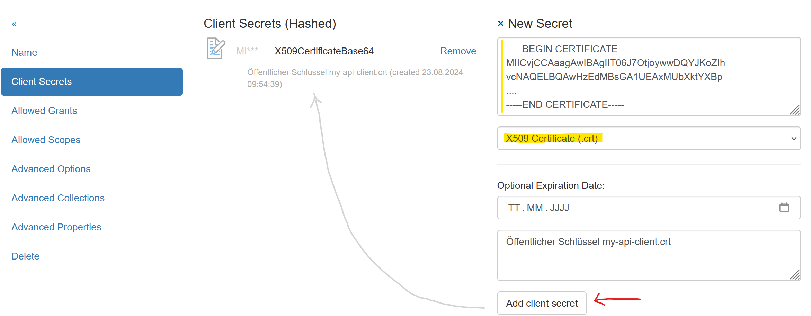
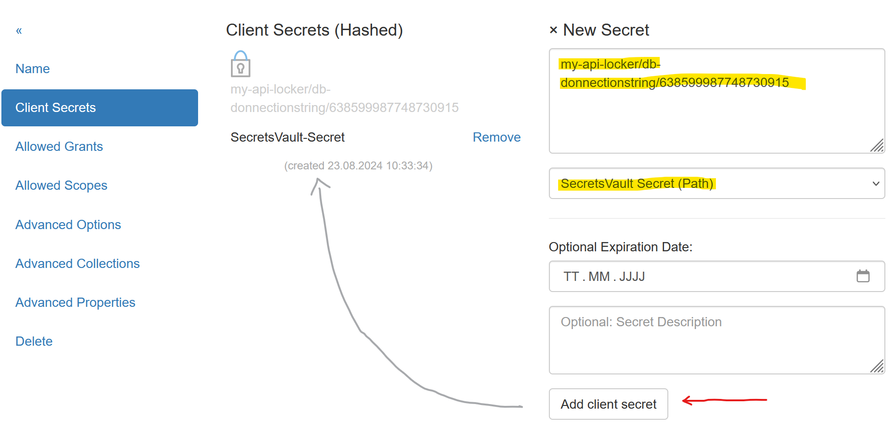
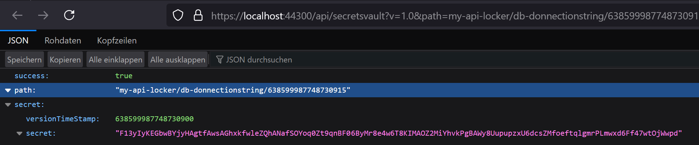

Secrets
=======

Um *Access Tokens* zu erhalten, muss/soll ein **Client** eine **Client Id** und ein 
**Client Secret** übergeben (**Client Id** und **Client Secret** entspricht in etwa
*User* und *Passwort*).

Hier werden die unterschiedlichen Arten von **Secrets** aufgezeigt.

Kein Secret verwenden
---------------------

Es können **Clients** eingerichtet werden, die kein **Secret** voraussetzen. Bei **Clients**
gibt es unter dem Menüpunkt ``Advanced Options`` folgende Option:

Ist die Option ``RequireClientSecret`` nicht gesetzt, muss ein **Client** kein Secret übergeben.

.. note::

    Diese Option nicht zu setzten, sollte nur bei ``Web Anwendungen`` erfolgen. Hier werden 
    unter dem Menüpunkt ``Advanced Collections`` noch ``Redirect Urls`` angegeben werden:

    .. image:: img/secrets2.png

    Da der Anmelde-Prozess bei *OpenId Connect* nur möglich ist, wenn auf eine dieser Urls
    weitergeleitet werden kann, ist eine **Web Application Client** damit eigentlich schon 
    abgesichert. 

.. note::

    **API Clients** sollten niemals ohne **Secret** eine AccessToken abholen können!

Shared Secrets
--------------

Die einfachste Art von Secrets sind ``Shared Secrets``. Dabei handelt es sich im 
Passwörter (Text):

.. note::

    Es können mehrere **Secrets** für einen **Client** angegeben werden. Ein **Client** 
    muss genau ein passendes **Secret** aus den hier angeführten übergeben.

.. note::

    **Secrets** können ein Ablaufdatum haben (``optional: Expire Date``). Das kann hilfreich sein
    wenn man einem Client nur für eine beschränkte Zeit Zugriff auf eine API haben sollte.

 Zu erstellen von sicheren **Secrets** kann der ``Random Secret Generator`` verwendet werden,
 der auf der Seite angeboten wird:

Ein so erzeugtes Passwort, kann aus dem Textfeld kopiert und in der Eingabemaske für ein 
``Shared Secret`` eingefügt werden.

X509 Certificate
----------------

**Clients** können auch über Zertifikate abgesichert werden. Dazu können die vorherigen Abschnitt
beschriebenen selbst-signierten Zertifikate verwendet werden.

Zu Absichern des **Clients** über ein Zertifikat sind folgende Files notwendig:

* **PFX Datei:** Beinhalte öffentlich und privaten Schlüssel und kann optional mit einem 
  Passwort geschützt sein. Dieses Zertifikat verwendet der **Client** um einen 
  *AccessToken* abzuholen.

* **CRT Datei:** Öffentlich Schlüssel (Text Format). Dieses Zertifikat wird am 
  *IdentityServer.Nova* als **Secret** hinterlegt.

Das *CRT-File* muss mit einem Text Editor geöffnet werden und der Inhalt in die Eingabemaske
kopiert werden. Als Typ für das **Secret** muss ``X509 Certificate (.crt)`` eingestellt werden.

Zugriff vom Client
++++++++++++++++++

Ein **Client** muss zuerst das Zertifikat auslesen:

.. code:: csharp

    var cert = new X509Certificate2(@"my-api-client-secret.pfx", "password");

Dieses Zertifikat kann dann an unterschiedliche Methoden aus dem **nuget** Paket 
``IdentityServer.Nova.Clients`` anstelle es *Shared Secrets* übergeben werden.

.. code:: csharp

    var tokenClient = new IdentityServer.Nova.Clients.TokenClient("my-api-commands", cert);
    await tokenClient.GetAccessToken("https://localhost:44300", []);

    var accessToken = tokenClient.AccessToken;

Secrets Vault
-------------

Im **Secrets Vault** (siehe vorheriger Abschnitt), können **Secrets** zentral gespeichert werden.
Die **Secrets** kann ein berechtigter **Client** über die **Secret Value API** abholen.

Damit die **Secrets** nicht an mehreren Stellen gepflegt werden müssen, können **Secrets** für
**Clients** auf direkt auf das **Secrets Vault** verweisen. Ändert man ein **Secret** im 
**Secrets Vault** muss es noch einmal im bei den **Secrets** für den **Client** verändert werden.

Anstelle des eigentlich **Secrets** wird der *Pfad* des **Secrets** im **Secrets Vault** eingetragen:

Um den Pfad für ein Secret herauszufinden, wechselt man als Administrator ins
**Secrets Vault** und klickt auf die entsprechende Version eines **Secrets**. Im Browser
wird ein JSON angezeigt, in dem auch der korrekte Pfad für das **Secret** aufgezeigt wird:

.. note::

    Als Pfad kann eine bestimmte Version, oder die letzte erstelle Version des Secrets herangezogen
    werden. Dafür muss im Pfad einfach die Version weggelassen werden, zb: 
    ``my-api-locker/db-donnectionstring``

Zugriff von Client
++++++++++++++++++

Der Zugriff auf das **Secrets Vault** wurde schon im Kapitel *Secrets Vault* beschrieben. 
Hier noch einmal das Beispiel mit der Annahme, dass der **API Client** für die
**Secrets Vault API** mit eine Zertifikat abgesichert wurde.

Ein **Client** muss zuerst das Zertifikat auslesen:

.. code:: csharp

    var cert = new X509Certificate2(@"my-api-client-secret.pfx", "password");

Dieses Zertifikat kann dann an unterschiedliche Methoden aus dem **nuget** Paket 
``IdentityServer.Nova.Clients`` anstelle es *Shared Secrets* übergeben werden.

.. code:: csharp

    var secretsVaultClient = new IdentityServer.Nova.Clients.SecretsVaultClient("my-api-secrets", cert);
    await secretsVaultClient.OpenLocker("https://localhost:44300", "my-api-locker");
    var secretResponse = await secretsVaultClient.GetSecret("db-connectionstring");

    Console.WriteLine(secretResponse.GetValue())

Auf diese Weise kann eine **Client Anwendung** geschrieben werden, bei der in der Konfiguration
keine Sensiblen Daten gespeichert werden müssen. Alle **Secrets** werden im **Secrets Vault**
gespeichert. Das einzige Geheimnis das für den Client noch notwendig ist, ist das optionale
Passwort für das Zertifikat (Kann theoretisch *hard coded* implementiert werden). 

Das Zertifikat kann regelmäßig ausgetauscht werden, dazu sind dann mehrere Schritte notwendig:

* Neues Zertifikat erstellen (eventuell mit dem gleichen Passwort)

* Für **Secrets Vault Client** den Inhalt des neuen CRT-File eintragen

* Für die **Client Anwendung** das neue PFX-File aktualisieren

