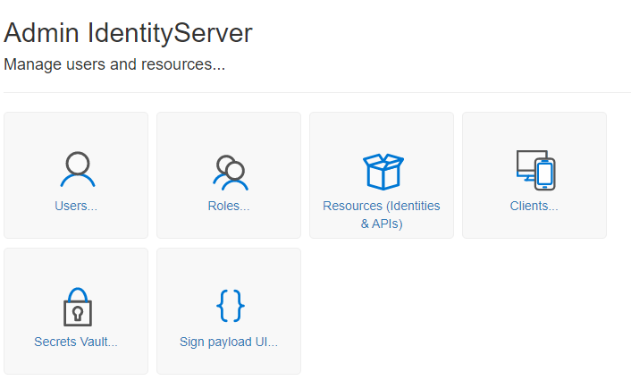
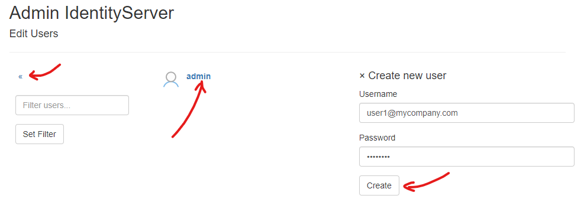
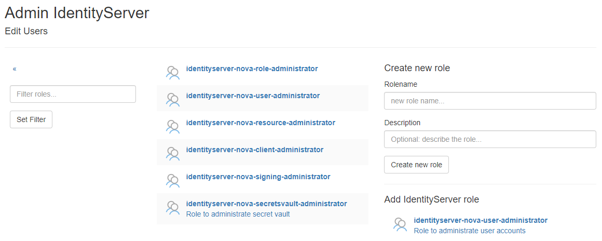
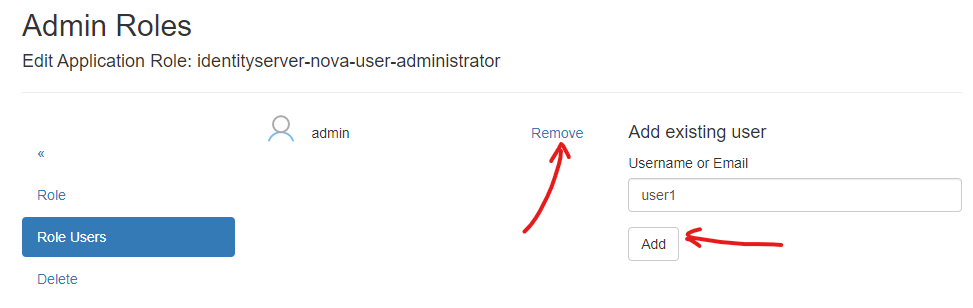
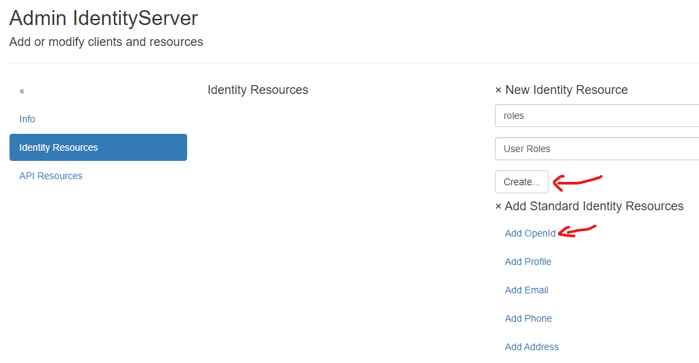
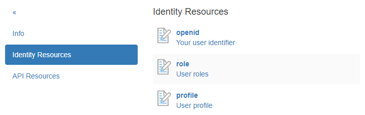
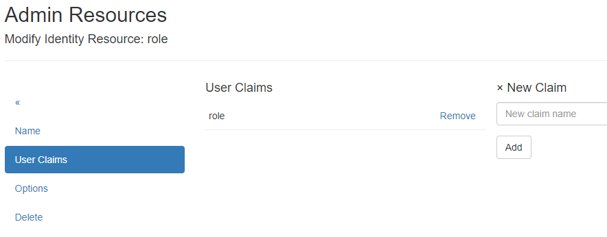

Administration des Servers
==========================

.. note::

    Hier wird nur die grundlegende Administration erläutert, auf spezielle Punkte (Web Anwendung als Client registrieren, ...) wird später genauer eingegangen.
    Ebenfalls wird nicht auf jede Administrationsseite eingegangen (zB ``User/Set Password``, ``User/Delete User``) da diese selbst erklärend sein sollten.

Klickt man als gemeldet Administrator auf der Startseite auf die Kachel ``Admin`` kommt nan zu folgender Anzeige:

User
----

Klickt man auf die Kachel User, erscheint folgende Ansicht:

.. note::

    Über das Symbol ``«`` im Menü kommt man immer auf die vorherige Ansicht zurück.

.. note::

    Wurden bereits viele User angelegt, kann die Liste über einen Filter eingeschränkt werden. Dazu gibt man einen Filter (zB. ``admin``)
    unter ``Filter users...`` ein und Klickt auf ``Set Filter``. Damit werden nur User angezeigt, die ``admin`` im Namen haben. Leert man 
    das Eingabefeld wieder und klickt erneut auf ``Set Filter``, werden wieder alle User angezeigt.

Hier können durch Klick auf ein User in der Liste Eigenschaften aus dem Profil des User administriert werden (Passwort, Name, Rollen).
Über `Create new user` kann auch eine neuer User angelegt werden.

.. note::

    Es wird empfohlen hier als Username immer eine E-Mail Adresse anzugeben. Diese sollte in der Regel eindeutig sein.

    Wenn der Username ein E-Mail Adresse ist, sollte die in Regel (User Registriert sich) auch bestätigt werden. In der Testumgebung kann
    der Administrator diesen Schritt übergehen und die E-Mail Adresse als bestätigt kennzeichnen:

    .. image:: img/admin-server3.png

    Eine spätere Anmeldung mit diesem User ist möglich, wenn die E-Mail Adresse als ``confirmed`` markiert ist!
   

Rollen
------

Klickt man auf die Kachel ``Roles``, kommt man zu folgender Ansicht:

Hier können Rollen verwaltet werden, die Usern zugeordnet werden können. Standardmäßig werden hier Rollen den **IdentityServerNET** aufgelistet, die angeben, ob ein User
bestimmte Administrationstätigkeiten erledigen kann. Über den Block ``Create new role`` können benutzerdefinierte Rollen erstellt werden.

Klickt man auf eine Rolle in der Liste können diverse Eigenschaften (Beschreibung) geändert oder die Rolle gelöscht werden.

Ebenfalls können her User einer Rolle zugeordnet oder aus einer Rolle entfernt werden:

Resourcen (Identites & APIs)
----------------------------

Klickt man auf die Kachel ``Resources (Identities & APIs)`` kommt man zu einer Ansicht, in der erklärt wird, was ``Identity Resources`` und ``Api Resources`` sind.

Hier geht es im ersten Schritt einmal nur im ``Identity Resources``. Diese geben an, welche ``Claims`` eine Client (Web) Anwendung bei einer Anmeldung abfragen kann. 
Die Einstellungen hier beziehen sich auf den kompletten Server. Hier wird nur angeben, was möglich sein kann. Später kann/muss man noch beim Einrichten einen Clients angeben,
welche ``Claims`` ein bestimmte Anwendung abfragen kann (``Scopes``). Dort werden dann nur die ``Identity Resourcen`` zur Auswahl gestellt, die hier angegeben werden.

Geht man zum Punkt ``Identity Resources`` wird folgende Ansicht angezeigt:

Hier können sowohl neue *Identity Resourcen* angelegt werden, oder *Standard Identity Resourcen* hinzugefügt werden. Für den Start sollte hier einmal die 
*Standard Identity Resourcen* ``OpenId`` und ``Profile`` hinzugefügt werden. Sollte eine Client Anwendung später auch die ``Rollen`` des angemeldeten Anwenders sehen,
kann auch noch eine benutzerdefinierte *Identity Resourcen* ``role`` angelegt werden:

Klickt man auf eine *Identity Resource* kann noch weitere Angaben gemacht werden, beispielsweise der Name des ``Claims``:

.. note::

    Bei benutzerdefinierten *Identity Resources* öffnet sich diese Seite beim Erstellen. Hier muss immer erst ein ``Claim`` Name vergeben werden.