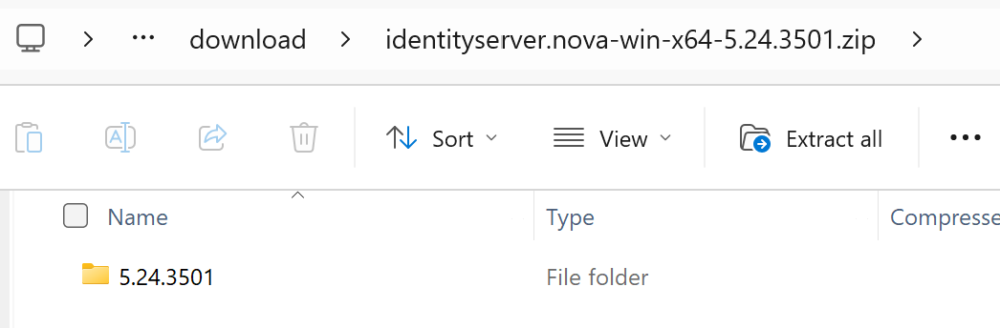
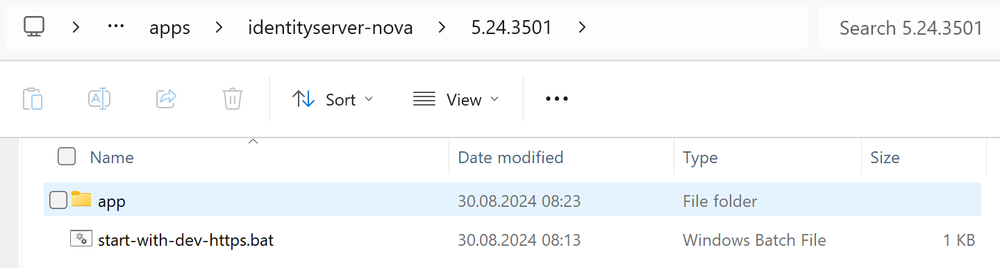
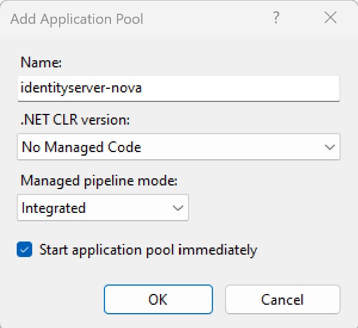
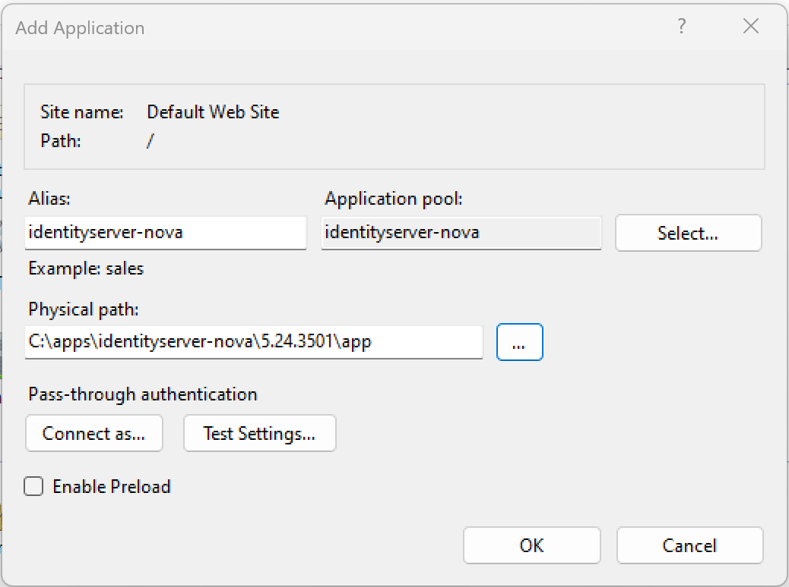

Installation unter Windows
==========================

.. note::

    Voraussetzung ist die Installation von ASPNET.Core 8.0. Gibt man in einer *Eingabeaufforderung*
    ``dotnet --info`` ein muss folgendes Framework in der Ausgabe vorhanden sein:

    .. code::

        .NET runtimes installed:
        Microsoft.AspNetCore.App 8.0.x [/usr/lib/dotnet/shared/Microsoft.AspNetCore.App]
        Microsoft.NETCore.App 8.0.x [/usr/lib/dotnet/shared/Microsoft.NETCore.App]

Für Windows liegen unter `Releases <https://github.com/jugstalt/identityserver.nova/releases>`_
ZIP Dateien mit dem Namen ``identityserver.nova-win-x64-{version}.zip``.

Das ZIP File enthält einen Ordner, der der Versionsnummer entspricht:

Dieser Ordner kann an einen beliebigen Ort kopiert werden, beispielsweise unter 
``C:\apps\identityserver-net``. Im Ordner befindet sich die eigentlich Anwendung
(Verzeichnis ``app``) und eine **Bat-Datei** zum Starten der Anwendung:

Anwendung lokal Starten
-----------------------

Mit der **Bat-Datei** ``start-with-dev-https.bat`` kann die Anwendung lokal gestartet werden.
Die Anwendung läuft danach unter http://localhost:8080 bzw https://localhost:8443.

.. code::

    cd .\app
    dotnet IdentityServer.dll --customAppSettings=dev-https

.. note::

    Der Server wird mit ``--customAppSettings=dev-https`` aufgerufen. Damit wird zusätzlich 
    die Konfiguration ``appsettings.dev-https.json`` geladen, in der die Ports und eine 
    Entwicklerzertifikat für die HTTPS Verbindung geladen werden.

Für die HTTPS Verbindung wird dabei nur ein Entwicklerzertifikat verwendet. Da dieses nicht 
von einer Vertrauenswürdigen Quelle signiert ist, liefert der Browser eventuell einen Fehler 
(nicht sicher ...), der aber ignoriert werden kann.

Anwendung im IIS einbinden
--------------------------

Um die Anwendung im IIS einzubinden, muss zuerst ein ``ApplicationPool`` erstellt werden:

Mit diesem **Application Pool** kann jetzt eine neu **Web Applikation** erstellt werden.
Der Physische Pfad ist dabei das ``app`` Verzeichnis:

