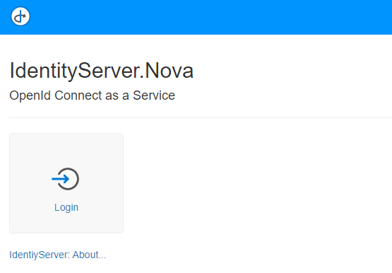
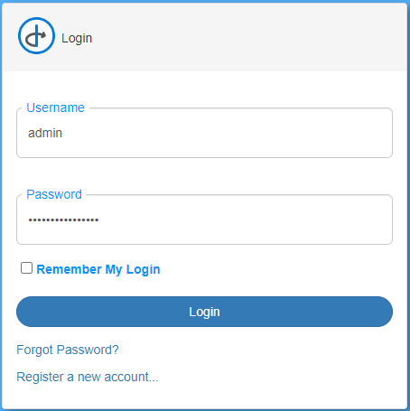
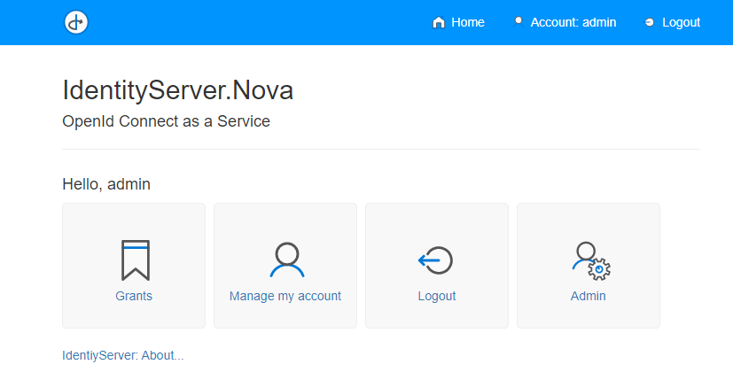
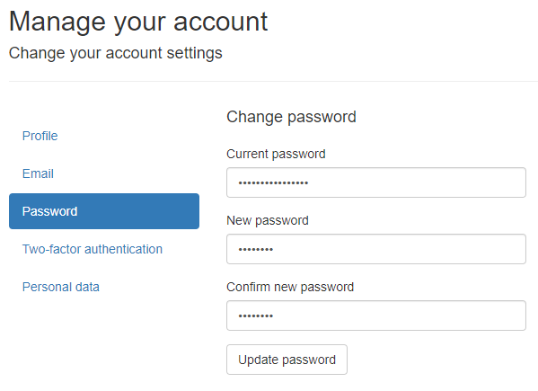
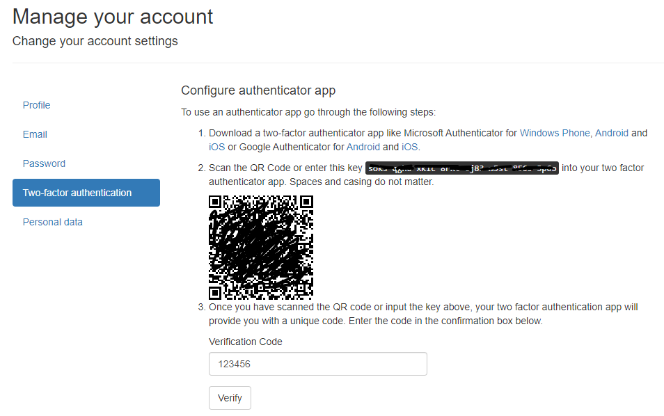
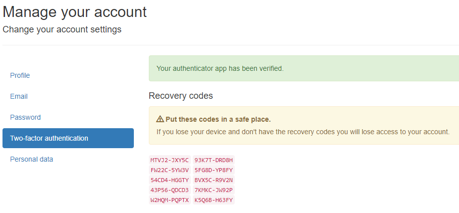
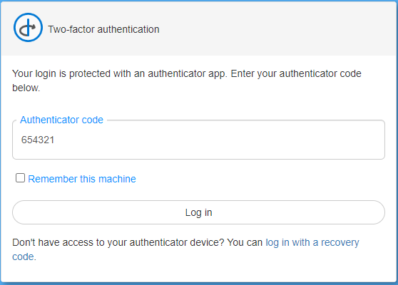
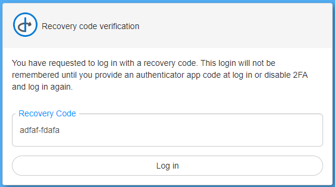

Als Administrator anmelden
==========================

Nach dem ersten Start sollte die Konsolenausgabe kontrolliert werden:

.. code-block:: bash

    [09:29:58 Information]
    Starting host...

    Using config file: _config/default.identityserver.nova.json (not exist)
    ################# Setup ##################
    ISigningCredentialCertificateStorage: IdentityServer.Nova.Services.SigningCredential.SigningCredentialCertificateInMemoryStorage
    IUserDbContext: IdentityServer.Nova.Services.DbContext.InMemoryUserDb
    IRoleDbContext: IdentityServer.Nova.Services.DbContext.InMemoryRoleDb
    IClientDbContext: IdentityServer.Nova.Services.DbContext.InMemoryClientDb
    IResourceDbContext: IdentityServer.Nova.Services.DbContext.InMemoryResourceDb
    User admin@is.nova created
    Password: Ay!ql5@r=xc%xOvq
    #########################################
    [09:29:59 Information] IdentityServer4.Startup

Hier wird angezeigt, welches Konfigurationsfile verwendet wird. Im Beispiel hier, wird der **IdentityServer.Nova** ohne existierendes 
Konfigurationsfile gestartet (``... not exist``). Das ist grundsätzlich möglich, in diesem Fall werden Standardwerte für die Konfiguration verwendet.

.. note::

    Das Start ohne Konfiguration ist nur für Testzwecke empfohlen. Hier werden alle Zertifikate, Benutzer, Rollen, Clients usw. nur im Speicher 
    abgelegt (InMemory Datenbanken). Wird die Anwendungen neu gestartet, sind alle Einstellungen die vorgenommen wurden, weg.

Im *Setup* Block wird angezeigt, welche Datenbank Instanzen verwendet werden. Folgende Datenbank werden hier aufgelistet:

* **ISigningCredentialCertificateStorage:** Hier werden die Zertifikate abgelegt. Über diese Zertifikate wird eine Anmeldung erst möglich gemacht,
  bzw. kann über diese Zertifikate (öffentlicher Schlüssel) die Gültigkeit eines (JWT-) Tokens überprüft werden. Die notwendigen Schlüssel dafür werden 
  vom IdentityServer auch über diese Url angeführt: https://my-identity-server-url/.well-known/openid-configuration/jwks

* **IUserDbContext:** Hier werden die User gespeichert
* **IRoleDbContext:** Hier werden die (User) Rollen gespeichert
* **IClientDbContext:** Hier werden Client gespeichert. Client sind (Web) Anwendungen, bei denen man sich über den **IdentityServer** anmelden kann.
* **IResourceDbContext:** Hier werden Resourcen gespeichert. Diese repräsentieren die `scopes`, die Anwendungen bei der Anmeldung übergeben können.
  
Falls in der *User Datenbank* noch kein Administrator angelegt wurde, wird ein solcher User beim Start angelegt. (``User admin created``).
Das Passwort wird hier zufällig gewählt und in der Konsolenausgabe angezeigt.

.. note::

    Dieses Passwort sollte in produktiven Umgebungen nach dem ersten Start geändert werden. Siehe weiter Vorgehensweise

Im Browser wird beim Ersten Start, folgendes angezeigt:

Klickt man auf ``Login``, kann man sich mit den ``admin`` User mit dem in der Konsolenausgabe angezeigtem Passwort anmelden:

Nach erfolgreicher Anmeldung sieht die Anzeige in etwas wie folgt aus:

Administrator Passwort ändern
-----------------------------

Das automatisch erstelle Administrator Passwort sollte in produktiven Umgebungen geändert werden. Dazu klickt man ``Manage my account``.

Hier können diverse Einstellungen zum Konto gemacht werden. Zum Ändern des Passwortes klickt man auf den Menüpunkt ``Passwort``. Hier 
muss noch einmal das aktuelle Passwort angegeben werden (`Current password`). Das neue Passwort muss zweimal angegeben werden (`New password`, `Confirm new password`).

Mit ``Update password`` wird das neue Passwort für zukünftige Anmeldungen neu gesetzt.

Zwei Faktor Authentifizierung
-----------------------------

Zur bessern Absicherung des Kontos ist eine Authentifizierung mit zweitem Faktor notwendig (über eine **Authenticator App**). Für den Administrator wird das empfohlen. 
Dazu klickt man im auf ``Two-factor authentication`` und dort auf ``Setup authenticator app``:

Im einer **Authenticator App** kann der hier angezeigt QR Code gescannt werden. Danach ist der erzeugt Code im Feld ``Verification Code`` einzutragen und mir ``Verify``
zu bestätigen.

Wird der ``Code`` akzeptiert, erscheint folgende Anzeige mit möglichen ``Recovery codes``. Diese können anstelle der ``Authenticator App`` verwendet werden. Jeder dieser 
``Recovery Codes`` kann nur einmal für die Anmeldung verwenden:

Meldet man sich jetzt vom **IdentityServer.Nova** ab (``Logout``) und erneut an, muss neben dem neuem Passwort auch ein ``Authenticator code`` eingeben werden:

Hat man die **Authenticator App** nicht zur Verfügung besteht noch die Möglichkeit sich mit einem der ``Recovery Codes`` anzumelden. Dazu klickt man auf den Link `log in with recovery code`:

